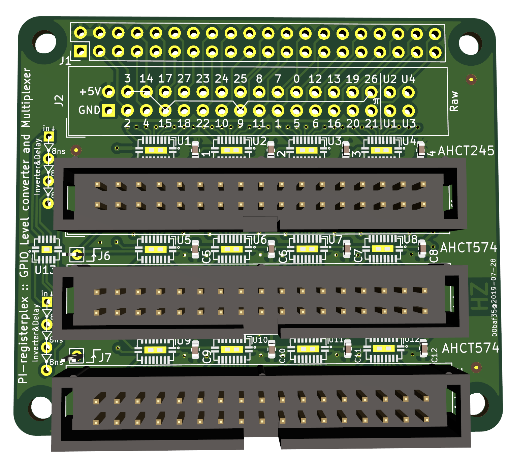

GPIO Multiplexer with registers
================================

 * 1x32 'raw' output of GPIO pins, or inputs if not used with a Pi
 * 1x32 bit buffer (AHCT245) to buffer all 28 GPIO bits plus 4 user bits
 * 2x32 bit registers (AHCT574) with user-choice of clock.
 * 6 NOT gates that can be used to use as clock inverter and play with gate
   delays.

This board directly plugs into the Rasbperry Pi and can be used as a GPIO
multiplexer with that, but the raw inputs are also available directly, so
this can be used in any project. The 34 pin connectors have the same
pinout throughout: +5V and GND followed by 32 bits of data.

Using the AHCT gates allows to voltage convert 3.3V logic levels to 5V.

The chip packages are [DHVQFN20], which allows for compact design and is
still somewhat easy to solder if you use a stencil.

Chip       | Package              | Vendor type example
-----------|----------------------|---------------
74AHCT245  | DHVQFN20 (SOT764-1)  | NXP 74AHCT245BQ,115
74AHCT574  | DHVQFN20 (SOT764-1)  | NXP 74AHCT574BQ,115
74AHCT04   | DHVQFN14 (SOT762-1)  | NXP 74AHCT04BQ,115

The clocks (`J6` and `J7`) of the registers are not connected by default, so
it allows you to choose any GPIO output or other signal to clock in the
registers.

The buffer and registers are for 32 bits, but we only have 28 GPIO outputs.
The remaining bits are passed through as user bits (`U1` ... `U4`) from inputs
on the `J2` 'Raw' header.

PCB is [shared on OshPark].

### Using two clocks
Pick two GPIO lines as a clock to connect to `J6` and `J7` allows to write
to the registers. Straight forward:

  1. write Datum1, transition clock2 `¯╲_`
  2. transition clock1 `_╱¯`  _(clocks in Datum1)_
  3. Write Datum2, transition clock1 `¯╲_`
  4. transition clock2 `_╱¯`  _(clocks in Datum2)_

In this case, the inverter gates are not needed.

### Using one clock
Chose one GPIO as clock and wire it up to an inverter. Wire up one of the 574's
directly to the pin, and the other through the inverter.

  1. Write Datum1
  2. transition clock `_╱¯` _(clocks in Datum1)_
  3. Write Datum2
  4. transition clock `¯╲_` _(the inverted signal clocks in Datum2)_

Same as above, but only one clock line needed.

### Danger zone: DDR with just two writes

Wire up the `Clock` line to at least one inverters, maybe more in one chain to
create some delay. Let's call this `Clock'`. Take the output of that through
another inverter, let's call this `Clock''`. Connect these to `J6` and `J7`.

 1. Clock in Datum1 and with it transition `Clock` `_╱¯`. The delayed
    clock prime that transitions to positive a few nanoseconds later will
    clock in the data.
 2. Clock in Datum2 and with it transition `Clock` `¯╲_`. The inverted clock
    from (1) now transitions to positive a few nanoseconds later
    will clock in the data.

Each write write will store one datum. Using the gates as
delay line and inverter, no separate cycle is needed, each swing of the
clock generates a store.

This is dangerous of course: it is not necessarily stable as we rely on the
delay to be long enough for the D-FlipFlops set-up time, and this will highly
depend on the chip manufacturer, temperature, age, ...
Maybe use RC + AHCT14 or LV14 Schmitt-Trigger for a more defined delay ?

[DHVQFN20]: https://www.nexperia.com/packages/SOT764-1.html
[shared on OshPark]: https://oshpark.com/shared_projects/xJGfE6Gh